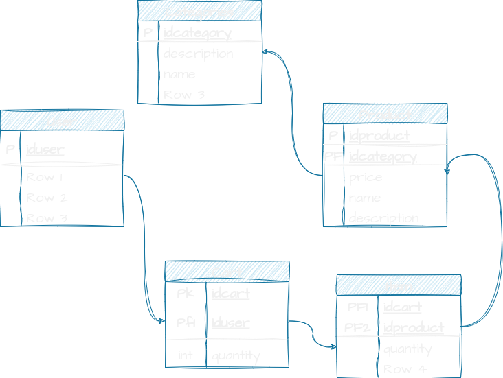

# Proyecto de una tienda SPA con Laravel, VueJS y Inertia.

> He usado la dependencia [breeze](https://laravel.com/docs/10.x/starter-kits) de laravel para la instalación de Vue3

## Instalación
En mi caso uso un contenedor docker a parte con una base de datos MariaDB y PhpMyAdmin. Para arrancar la aplicación uso `php artisan serve` y `npm run dev`, para arrancar ambos servidores de desarrollo. En un futuro añadiré los ficheros de docker para automatizar el proceso de despliegue.

Solo nos haría falta correr los comandos `composer install`, `composer require laravel/breeze`, `php artisan breeze:install vue`. Con esos comandos hechos al arrancar los servidores deberíamos de tener la aplicación funcionando en el puerto 8000. He dejado las migraciones y seeders preparados también para que el proceso de arrancar la web sea lo más rápido posible.

## Datos
En este caso, he automatizado los seeders y migraciones para una aplicación de tecnología. Los seeders hacen peticiones a una API externa la cual nos devuelve los datos de ciertos aparatos con sus fotos para poder introducirlas en la Base de datos. La API que he encontrado SOLO nos da 10 que siempre son los mismos, por lo que en un futuro puede que añada otra API que nos dé más datos pero por ahora con 10 es suficiente.

## Funcionamiento
Tenemos la vista principal de Vue, la cual devuelve una plantilla sin datos, al cargar la aplicación el Hook de Vue `onMounted()` salta y este ejecuta la función de petición de datos al back-end de laravel por medio de la librería axios, la cual viene pre-instalada con Breeze, y esta nos facilita de fábrica el token CSRF para poder hacer peticiones a Laravel.

La base de datos es algo compleja, con relaciones para relaciones que tienen en cuenta una implementación de carrito de compra e incluso en un futuro implementación de compras con E-bay.

### Herramientos adicionales 
    
 · [HeadlessUI](https://headlessui.com/) -> Componentes Gratuitos y funcionales para Vue.  
 · [VueAwesomePaginate](https://vuejsexamples.com/vue-awesome-paginate-a-modern-and-powerfull-vue-js-pagination-library-with-a-large-set-of-various-pagination-components/) -> Librería para paginar con VueJS.  